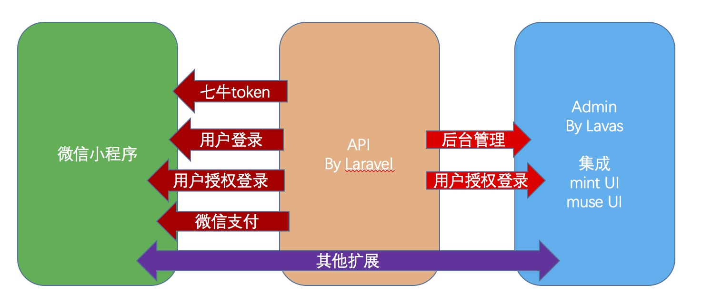

# wechat-laravel-lavas-system【WLLS】
主要目的是在微信小程序系统的搭建初期，方便快速构建，前后台页面基本框架，基本的用户注册登录和图片/视频等资源的上传以及微信支付。

主要功能：

* Laravel提供API基础功能（用户，七牛，微信支付，等）
* Lavas后台admin网站登录使用微信小程序授权，并支持权限管理
* 微信小程序用户自动注册和登录
* Lavas集成UI插件（mint UI,muse UI）,兼容PC和移动前端

# 写在最前：
参考和使用的git代码：

[laravel-boilerplate]
[laravel-boilerplate]: https://github.com/francescomalatesta/laravel-api-boilerplate-jwt

[小程序授权登录思路参考]

[小程序授权登录思路参考]: https://blog.csdn.net/P6P7qsW6ua47A2Sb/article/details/78892430

[微信小程序二维码官方介绍]

[微信小程序二维码官方介绍]: https://developers.weixin.qq.com/miniprogram/dev/api/qrcode.html

[Lavas百度官方介绍]

[Lavas百度官方介绍]: https://lavas.baidu.com

另外，希望你是知道什么是laravel，lavas等，或者知道一些开源框架的基本使用。

(详细编写中...)

# 环境安装

基础环境要求
php7.1

composer

npm

laravel（https://laravel.com/docs/5.6/installation）

lavas（https://lavas.baidu.com/guide/v2/basic/install）

nodejs

# 代码运行
1. Laravel:

进入laravel目录，composer install
配置config
1/ .env文件
拷贝.evn.example为.evn，并修改关键参数：
数据库mysql （提前创建一个空的数据库db，不需要创建table）
APP_NAME
JWT_SECRET(手动改一下，或者生成，或者不改)
APP_KEY（手动改一下，或者生成，或者不改。php artisan key:generate）

2/ composer install

3/ 生成基础数据库migration
(先确保数据库db已经创建)
php artisan migrate

4/ 本地测试。建议使用valet（参见官方:https://laravel.com/docs/5.6/valet）

# 后台admin授权登录设计
参考附件：《微信小程序授权登录设计-0609.pptx》

# 部署到服务器
